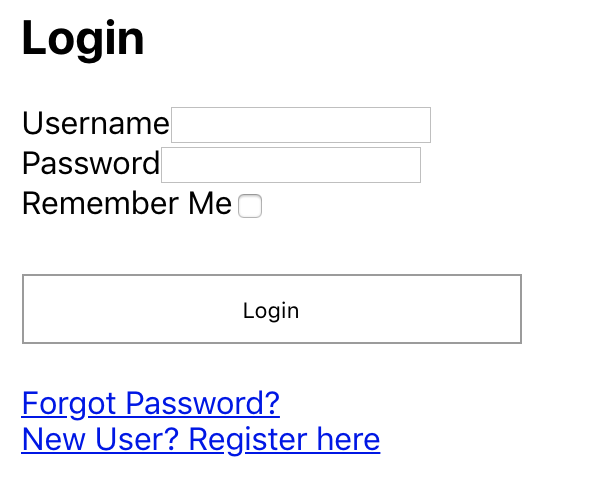

Reforma
=======

[](https://greenkeeper.io/)

## A Local State Driven Approach to Forms in React

Reforma focuses on creating forms quickly and easily, by letting the developer
worry about things like `validation` and `server responses`. Utilizing and easy
to use plug-and-play API, Reforma makes building forms easy.

```js
import Reforma, { InputField, CheckboxField } from 'react-reforma';

export default function LoginForm(props) {
  const { onSubmit, errors } = props;

  return (
    <Reforma
      className="reforma-form"
      onSubmit={this.onSubmit}
      errors={this.state.errors}>
      <h2>Login</h2>
      <InputField name="username" label="Username" />
      <br/>
      <InputField type="password" name="password" label="Password" /><br/>
      <CheckboxField
        label="Remember Me"
      />
      <br/>
      <button className="submit" type="submit">Login</button>
      <div className="login-links">
        <a href="/reset-password">Forgot Password?</a><br/>
        <a href="/register">New User? Register here</a>
      </div>
    </Reforma>
  );
}
```

This creates a simple form that looks like this:


* No need to write `onChange` or determine `value` props for input fields, all
that logic is handled for you.

* No need to worry about the state of the form. The local state is handled and
update for you using all the performance goodies of `React.PureComponent`.

* No need to worry about 3rd party validation libraries either. **Reforma** uses
 _only vanilla React 16_.

* Nest fields as deeply as you want, and style with container elements. Reforma
  intelligently clones all `<*Field>` elements and attaches `onClick`, `value`,
  and shows `errors` if the `errors` prop is shown.

* Fields are built with `React.Fragment`, ensuring the fewest number of DOM
  nodes are rendered, maximizing performance and development speed, without
  making sacrifices for styling and container hierarchy.

Reforma is focused 100% on the _construction and building_ of forms, leaving
elements like validation and submit logic to the developer, not out of the box
like other form libraries.

## Why Reforma, and not Redux-Form or Formik?

Redux-Form and Formik are excellent and well written tools that make creating
forms fast and easy, but I noticed that there's something missing from forms in
React:

* **Redux-Form causes unnecessary re-renders** - Whenever there's a change event
 in Redux-Form, the entire app from the `Provider` component emits three
 distinct actions, `onKeyUp`, `onKeyDown`, and `onChange`.

  * **Redux-State** is meant for ephemeral state to be shared between many
    components, not just one component. If the values of a form need to travel
    to many different components that don't have a parent-child relationship,
    Redux-Form is great! But otherwise, it's just not efficient and abusing
    Redux state.

* **Formik** has all the bells and whistles with validation and submit logic.
  While I really like Formik and everything it has to offer, it can make your
  form look really big and bloated. I'm a firm believer in having errors passed
  in from the parent component's state, and values to live in the individual
  component's state

* **Reforma** Focuses solely on the building of forms, and leaves whatever you
want to use for validation and form submission to your own devices. Every server
 interprets data differently, handles errors and validation their own way,
 whether it's client-side or server-side, and does its own submit logic their
 own way.

In a nutshell, **Reforma** is completely agnostic to validation and submission.
It only worries about building forms quickly and easily without styling.

## Installation

You can install Reforma with some quick `npm` commands:

```sh

npm install react-reforma --save

```

Or if you're using `yarn`

```sh

yarn add react-reforma

```

## Reforma Basics

The default export is the root `Reforma` element

```js

import Reforma from 'react-reforma';

```


You can also import the form fields here as well:

```js
import Reforma, {
  InputField,
  SelectField,
  RadioButtonField } from 'react-reforma';
```

## Usage

All Reforma fields need to live as a child of `<Reforma>`

```js
import React, { Component } from 'react';
import Reforma, {
  InputField,
  SelectField,
  RadioButtonField } from 'react-reforma'


class MyComponent extends Component {
  constructor(props) {
    super(props);

    this.state = {
      errors: {}
    };

    this.onSubmit = this.onSubmit.bind(this);
    this.validate = this.validate.bind(this);
  }

  onSubmit(values) {
    // Your submit logic goes here!
  }

  validate(values) {
    // Your validation logic goes here!
    if (/* Some condition where email is invalid... */) {
      this.setState({
        errors: {
          email: 'Invalid email address'
        }
      });
    }
  }

  render() {
    return (
      <Reforma
        onSubmit={this.onSubmit}
        onValueChange={this.validate}
        errors={this.state.errors}>
        <InputField
          name="first_name"
          label="First Name"
          placeholder="Enter your name"
        />
        <InputField
          name="last_name"
          label="Last Name"
          placeholder="Enter your surname"
        />
        <InputField
          name="email"
          type="email"
          placeholer="name@example.com"
        />
        <button type="submit">Submit</button>
      </Reforma>
    );
  }
}

export default MyComponent;
```


## The `<Reforma>` Component

`<Reforma>` Component props:

| Prop          | Type         | Required? | Description                                                                           | Default Value   |
|---------------|--------------|-----------|---------------------------------------------------------------------------------------|-----------------|
| className     | String       | No        | className to pass into the root `<form>` element                                      | undefined       |
| onSubmit      | Function     | Yes       | Function to use for submitting the form. Returns a `ValuesObject`. More on that later | Required        |
| onValueChange | Function     | No        | A function that fires whenever a form's field value has been changed.                 | Empty function  |
| initialValues | ValuesObject | No        | The initial values for when the form constructs.                                      | {} Empty Object |
| errors        | ErrorsObject | No        | Creates Errors. More on this later                                                    | {} Empty Object |

### `ValuesObject` and `ErrorsObject`

A form that looks like this:
```js
<Reforma onSubmit={this.onSubmit}>
  <InputField name="first_name" />
  <InputField name="middle_name" />
  <InputField name="last_name" />

  <InputField name="email" type="email" />
</Reforma>
```

Will yield a `ValuesObject` that looks like this:

```js
{
  first_name: "Smiggles",
  middle_name: "The",
  last_name: "Dolphin"
}
```
Where the `name` of the field is the `key`, and the `value` is the field's
`value`.

If you want to send in some errors to the form you can send an `ErrorsObject` as
the `errors` prop:

```js
const errorsObject = {
  last_name: 'How did a Dolphin type into this form? Does the ocean have wifi now?'
};

<Reforma onSubmit={this.onSubmit} errors={errorsObject}>
  <InputField name="first_name" />
  <InputField name="middle_name" />
  <InputField name="last_name" />

  <InputField name="email" type="email" />
</Reforma>

```

In practice, it's normal to keep the `errorsObject` in the parent component's
`state`, then pass the parent Component's `this.state.errors` into `<Reforma>`

```js
<Reforma onSubmit={this.onSubmit} errors={this.state.errors}>
  <InputField name="first_name" />
  <InputField name="middle_name" />
  <InputField name="last_name" />

  <InputField name="email" type="email" />
</Reforma>
```

## <*Field> components

Reforma comes with a handful of field components:

  * `<InputField>` for `<input />` fields.
  * `<SelectField>` for `<select />` fields.
  * `<RadioButtonField>` for `<input type="radio" />` fields.
  * `<CheckboxField>` for `<input type="checkbox" />` fields.
  * `<TextAreaField>` for `<textarea />` fields.

Each field can be passed in the following props:

| Prop           | Type          | Required? | Description                                                                                                  | Default Value     |
|----------------|---------------|-----------|--------------------------------------------------------------------------------------------------------------|-------------------|
| label          | String or JSX | No        | Creates a `<label>` element before the field. Can use JSX. Useful for Radio buttons or checkbox elements     | undefined         |
| labelProps     | Object        | No        | Props to pass in to the `<label>` element                                                                           | {} (empty Object) |
| className      | String        | No        | The field's className                                                                                        | undefined         |
| placeholder    | String        | No        | Placeholder prop to pass in for `<input>` elements                                                           | undefined         |
| name           | String        | Yes       | Name to use as the key or identifier for the element                                                         |                   |
| injectOnChange | Boolean       | No        | If `false`, Reforma will ignore this field and let you control it with your own `onChange` and `value` props | true              |


Any additional props passed on a `<*Field>` element can take in additional props, like `data-*`, `id`, etc.

## Field Specific props

### `<InputField />`

* `mask` - Adds input masking to the element. Uses [react-input-mask](https://github.com/sanniassin/react-input-mask) for ease of use. For more details on how to use this prop, [Read up here](https://github.com/sanniassin/react-input-mask#properties)

* `type` - defines the "type" prop for the `<input>` field. Defaults to `"text"`, but can be `"password"` `"email"` `"tel"` `"url"` or `"number"`.


### `<SelectField />`

* `children` - Can be either `<option>` elements, or a `function` that returns `<option>` elements.


Using plain `<option>` elements
```js
<SelectField name="year">
  <option value="">Select a year</option>
  <option value="2018">2018</option>
  <option value="2019">2019</option>
  <option value="2020">2020</option>
  <option value="2021">2021</option>
  <option value="2022">2022</option>
</SelectField>
```

Using a `function`
```js


const currentYear = (new Date()).getFullYear();
return (
  <SelectField name="year">
    { () => {
      return [...Array(5).keys()].map(val => {
        const displayValue = val + currentYear;
        return <option value={displayValue}><{displayValue}</option>;
      });
    }}}
  </SelectField>
);

```


Or... Why not both?

```js
<SelectField name="year">
  <option value="">Select a year</option>
  { () => {
      return [...Array(5).keys()].map(val => {
        const displayValue = val + currentYear;
        return <option value={displayValue}><{displayValue}</option>;
      });
  }}}
</SelectField>

```

### `<RadioButtonField>`

If you need a group of three radio buttons, create 3 fields with different
`radioValue` props, but with the same name:

```js
<RadioButtonField
  name="card_type"
  label="Visa"
  radioValue="Visa"
/>
<RadioButtonField
  name="card_type"
  label="Mastercard"
  radioValue="mastercard"
/>
<RadioButtonField
  name="card_type"
  label="American Express"
  radioValue="amex"
/>
```

#### Custom Radio Button Labels

If you're hiding the default browser UI for radio buttons and want to use
something in the `<label>`, you will need to pass in a unique `id` prop to
  `<RadioButtonField>`, since Reforma cannot use `name` and must resort to an
`id` to handle click events.


## Tips and Tricks

### Using `refs`

Reforma doesn't have to be a form. You can use it as a store of key/value pairs
for user entry by using React `refs`.


```js

class MyComponent extends Component {
  constructor(props) {
    super(props);

    this.reformaForm = React.createRef();
    this.onSubmit = this.onSubmit.bind(this);
    this._internalSecretMethod = this._internalSecretMethod.bind(this);
  }

  onSubmit(values) {
    // Submit logic goes here
  }

  _internalSecretMethod() {
    console.log(this.reformaForm.values); // =>
  /*
    {
      plant: 'Orchid',
      rock: 'Rocky'
    }
   */

  }

  render() {
    return (
      <Reforma ref={this.reformaForm} onSubmit={this.onSubmit}>
        <InputField name="plant" label="Favorite Plant" />
        <InputField name="rock" label="Favorite Rock" />
      </Reforma>
    )
  }
}
```
Notice the lack of a "submit" button. This approach is good for combining the
values inside of reforma with other forms that don't use `<Reforma>`

**NOTE**:

If you attach a ref: make sure:
1. You are accounting for `undefined` or `null` when attempting to access
   `this.reformaForm` or whatever you decide to name your ref.
2. Do not attempt to manually set the state of `<Reforma>` or force re-renders.
3. Use the ref as a `read-only` property.

### Retrieving just values (with a ref)

If you want to access the forms `ValuesObject`, you can use:
```
this.reformaForm.values;
```
And it will return all the values in a `ValuesObject`.

This project was made with <3 by @MrBenJ - Proudly hosted on GitHub, and happy
to be an OSS project.


